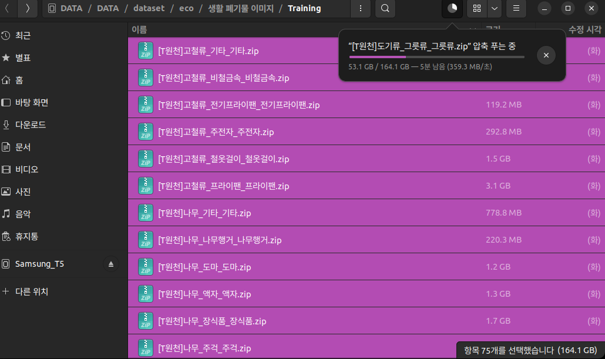

# Detection
## 진행상황 
### 1. 데이터 파싱 

- 가구와 같이 전문적 수거가 필요한 항목은 train set에서 제거한다.
- zero shot detection이 필요할 경우 hugging face에서 owl-vit를 로드한다.

### 2. train
- vram
- time
- loss optim
- config
- so.on

### 3. inference
- local cam, test cam, app cam의 rgb 분포를 최대한 동일시 한다.
- iou th, confidential th를 최적화 한다.

### done

